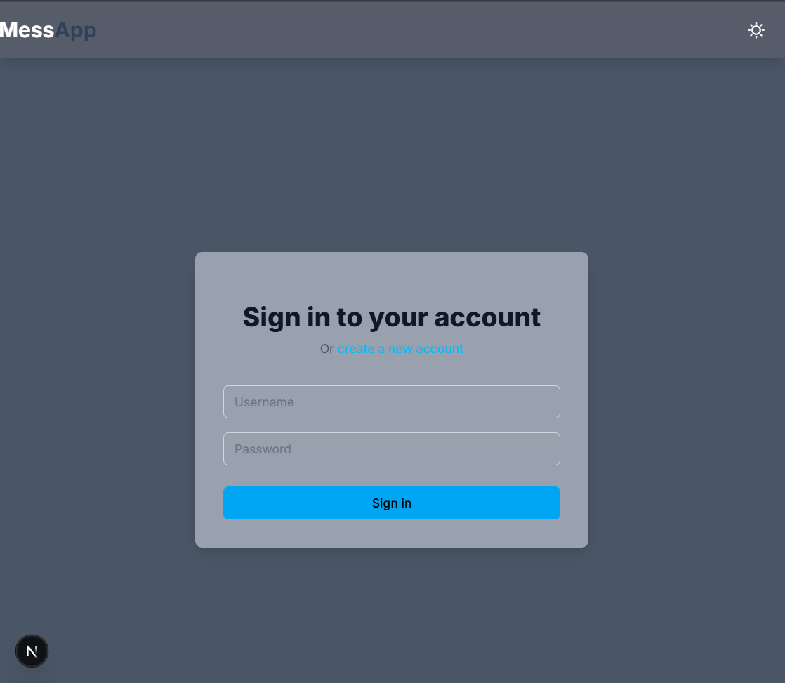

# Real-Time Messaging Application

This is a real-time messaging application built with .NET Web API, MongoDB, and SignalR that can be easily integrated into other projects.

## Technology Stack

- Backend: .NET 8 Web API
- Real-time Communication: SignalR
- Database: MongoDB
- Frontend: .NET Client (planned)

## Project Structure

```
MessengerApp/
├── MessengerApp.API/           # Backend Web API project
│   ├── Controllers/            # API endpoints
│   ├── Models/                 # Data models
│   ├── Services/               # Business logic
│   ├── Hubs/                   # SignalR hubs
│   └── Configuration/          # App configuration
```

## Features (Planned)

- Real-time messaging between users
- User authentication and authorization
- Message history storage in MongoDB
- Group chat support
- Online/offline status
- Message read receipts
- File sharing support

## Implementation Steps

1. Backend Setup (Current Phase)
   - Set up .NET Web API project ✓
   - Configure MongoDB connection
   - Implement SignalR hub
   - Create message models and DTOs
   - Implement authentication

2. API Development
   - User management endpoints
   - Message handling endpoints
   - Group chat functionality
   - File upload support

3. Frontend Development
   - Create .NET client application
   - Implement real-time message display
   - Add user interface for chat
   - Implement file sharing UI

## Screenshots

### User Interface


### Message History


### Group Chat Feature


// Additional Screenshots
### File Sharing Feature


### Online/Offline Status


## Getting Started

1. Clone the repository
2. Configure MongoDB connection string in appsettings.json
3. Run the backend API project in terminal:
- ``` bash cd MessengerApp.API ```
- ``` dotnet build ```
- ``` dotnet run ```
4. Run the frontend clien:
 - ```cd messenger-next2```
 - ```npm run build```
 - ``` npm run dev```


## Configuration

The application requires the following configuration in `appsettings.json`:

```json
{
  "MongoDb": {
    "ConnectionString": "your_connection_string",
    "DatabaseName": "MessengerApp"
  }
}
```

More details will be added as the project progresses.